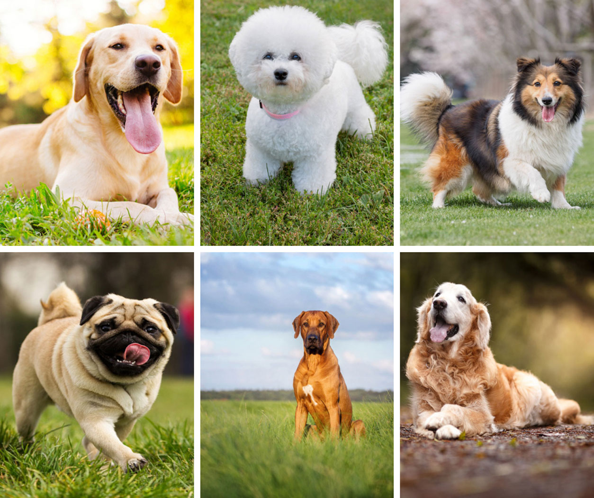

# Dog-Breed-Classification

Who's a good dog? Who likes ear scratches? Well, it seems those fancy deep neural networks don't have all the answers. However, maybe they can answer that ubiquitous question we all ask when meeting a four-legged stranger: what kind of good pup is that?

In this project, we are provided a strictly canine subset of ImageNet in order to practice fine-grained image categorization. How well can we differentiate between Norfolk Terriers and Norwich Terriers? With 120 breeds of dogs and a limited number training images per class, this project is a bit complicated to solve.

## 1. Data pre-processing
We use the concept of Transfer Learning, which being said refers to technique which allows you to use the pretrained models on your own Dataset. Here we are going to use InceptionV3 model. InceptionV3 is a convolutional neural network for assisting in image analysis and object detection, and got its start as a module for Googlenet. It is the third edition of Google's Inception Convolutional Neural Network, originally introduced during the ImageNet Recognition Challenge. Just as ImageNet can be thought of as a database of classified visual objects, Inception helps classification of objects in the world of computer vision. 

Here we replace the top Layers(Fully Connected Layers and the softmax layers) and freeze the rest Layers so that they are non trainiable. Also we will make use of Synthetic Imge Generation to take into account the randomness in the images.

## 2. Data source and transformation
Download the [Dataset](https://www.kaggle.com/c/dog-breed-identification/data) and extract and crop the images with the help of annotaions provided . Now we split the Dataset into Training,Validation and Testing,This should be done carefully ensuring there is no class imbalance in various chunks.Dataset can be converted into **tfRecords** Format as this format allows faster input and output operations. 

## 3. Execution

a. Optimizer: Adam optimizer

b. Metrics: loss (categorical_crossentropy), accuracy

c. Last Layer Activation function: softmax	

d. Last Layer Activation function: relu

e. 0.2 dropout added in-between layers

f. Callback added for accuracy greater than 97%

g. Batch size: 500

h. Data Augmentation done by rescaling, rotating, sheering, zooming & horizontally flipping
